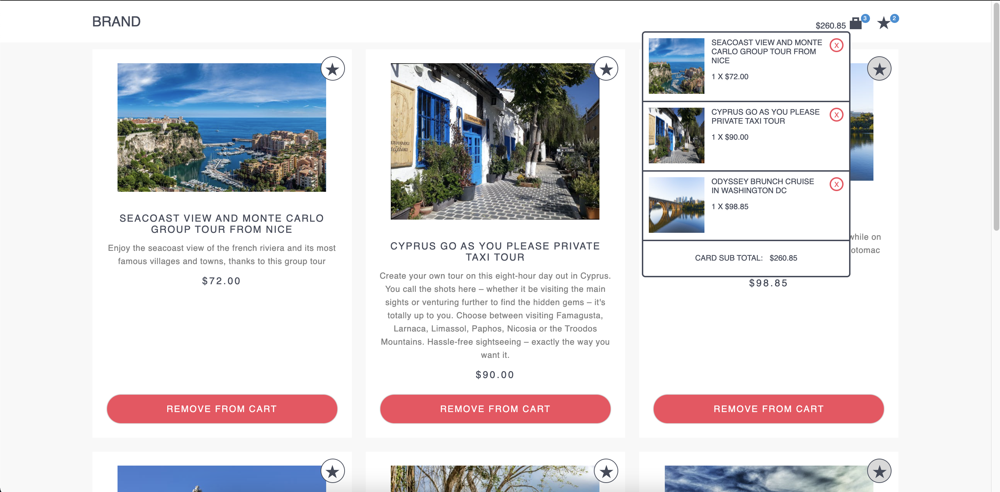
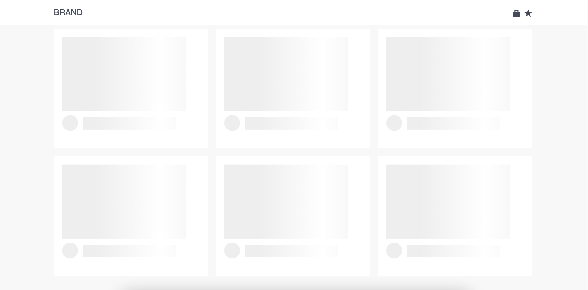

# Getting Started

You can reach source code of Musement JS Challenge developed by me. Also if you would like to see directly how it work please [click here](https://js-challenge-gokalp-gursoy.vercel.app/)



It is a responsive product listing page. Also if you want to buy this product it is possible to Adding that product to the cart or if you want to buy it later you can add that product to your Wishlist.

You can reach the products to click the BAG or STAR icon in Navbar which you adding cart or adding wishlist.

At first glance you can see only 6 products. If you want to see more products you can use the pagination section.

In addition, if the internet speed is slow, a skeleton loader is used in order not to spoil the user experience. You can see it below.



## Project setup

```
npm install
```

### Compiles and hot-reloads for development

```
npm run serve
```

### Compiles and minifies for production

```
npm run build
```

### Run your unit tests

```
npm run test:unit
```

### Lints and fixes files

```
npm run lint
```
